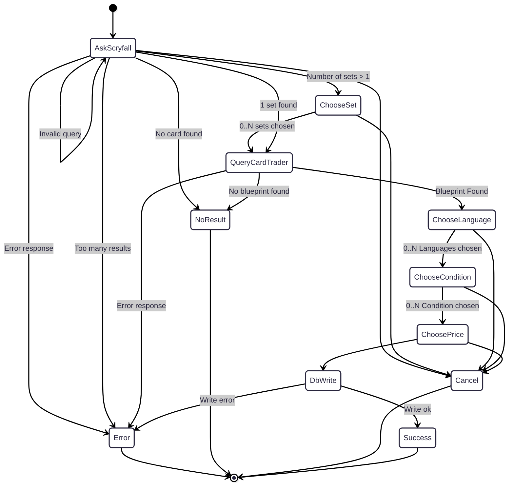

```mermaid
---
config:
      theme: redux
---
stateDiagram-v2
    AskScryfall
    DbWrite
    ChooseLanguage
    ChooseCondition
    ChoosePrice
    ChooseSet
    Cancel
    Error
    NoResult
    QueryCardTrader
    Success

    [*] --> AskScryfall
    AskScryfall --> Error: Error response
    Error --> [*]
    AskScryfall --> AskScryfall: Invalid query
    AskScryfall --> NoResult: No card found
    NoResult --> [*]
    AskScryfall --> Cancel
    Cancel --> [*]
    AskScryfall --> Error: Too many results
    AskScryfall --> ChooseSet: Number of sets > 1
    ChooseSet --> Cancel
    ChooseSet --> QueryCardTrader: 0..N sets chosen
    AskScryfall --> QueryCardTrader: 1 set found
    QueryCardTrader --> Error: Error response
    QueryCardTrader --> NoResult: No blueprint found
    QueryCardTrader --> ChooseLanguage: Blueprint Found
    ChooseLanguage --> Cancel
    ChooseLanguage --> ChooseCondition: 0..N Languages chosen
    ChooseCondition --> Cancel
    ChooseCondition --> ChoosePrice: 0..N Condition chosen
    ChoosePrice --> Cancel
    ChoosePrice --> DbWrite
    DbWrite --> Error: Write error
    DbWrite --> Success: Write ok
    Success --> [*]
```